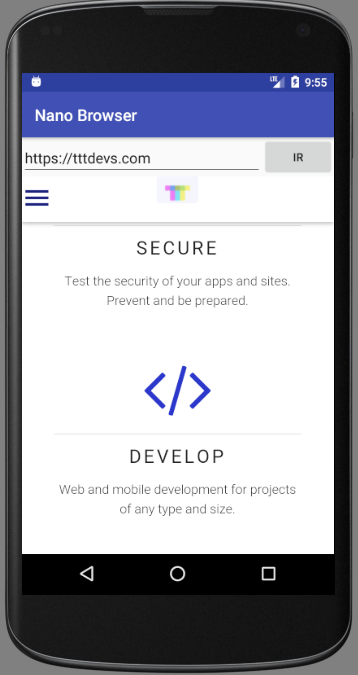

# NanoBrowser
Aplicación de ejemplo para el curso de introducción al desarrollo en Android dictado en [Gran Reactor](https://granreactor.comg), en Febrero de 2018.

Coordinador: [Martín Vukovic](https://martin.tttdevs.com)

Navegador web super minimalista. 

La mayoría de la lógica es gestionada automáticamente por el WebView. Permite volver atrás en el historial de navegación y muestra un diálogo de confirmación antes de cerrar la app.

Esta aplicación se utilizó para ejemplificar el uso de:

- RelativeLayout
- EditText
- Button
  - onClickListener
- WebView
  - WebSettings
  - loadUlr()
  - canGoBack()
  - goBack()
- onBackPressed()
- AlertDialog
- Permisos: Internet